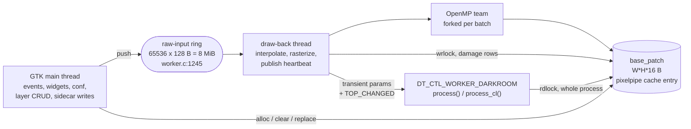
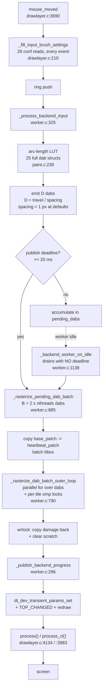

# The drawlayer module

`src/iop/drawlayer.c` plus `src/iop/drawlayer/` is a painting layer: a full-resolution RGBA
canvas per layer, a brush that stamps dabs into it, a sidecar TIFF that stores it, and a
composite into the pipe. This note is the map — what the parts are, which thread owns what,
and where a realtime stroke's time goes. It was written from a full read of the module; every
number below is derived from the code and cites it.

---

## 1. The module is not the directory

`src/iop/CMakeLists.txt:223` compiles **seven** of the eleven `.c` files. The other four —
`conf.c`, `coordinates.c`, `worker.c`, `layers.c` — are text-`#include`d into `drawlayer.c`
(`drawlayer.c:160`, `:161`, `:1558`, `:1563`). The real translation unit is **7130 lines**.

That matters for every reading of this code: a `static` in `worker.c` is in the same namespace
as a `static` in `drawlayer.c`, the directory buys no encapsulation, and the file boundaries
suggest an ownership split that the linker does not enforce. `_commit_dabs` at `worker.c:1157`
resolving to `dt_drawlayer_commit_dabs` in `drawlayer.c` — across what looks like a module
boundary — is only possible because of this.

Actual units, by role:

| file | lines | role |
|---|---|---|
| `drawlayer.c` | 4254 | module API, GUI, the whole OpenCL composite, `process`/`process_cl` |
| `worker.c` | 1665 | the `draw-back` thread, the ring, batching, the heartbeat |
| `io.c` | 1151 | sidecar TIFF read/write |
| `runtime.c` | 1001 | the event→schedule→action dispatcher |
| `paint.c` | 981 | pointer samples → dabs (interpolation, spacing, smoothing) |
| `brush.c` | 913 | the per-pixel rasterizer |
| `widgets.c` | 860 | widget construction helpers |
| `cache.c` | 642 | patch allocation over the pixelpipe cache arena |
| `layers.c` | 484 | layer CRUD, the GUI-side canvas loader |
| `conf.c` | 370 | preferences |
| `coordinates.c` | 357 | coordinate spaces |

---

## 2. Four threads, and what each may touch

**Ownership is not clean, and that is the module's central defect.** The same `base_patch` is
written by the worker (`worker.c:961-970`), read by the pipeline across a whole `process()`
(rdlock `drawlayer.c:1621` → released `runtime.c:975` via `:4238`/`:4117`), and replaced by the
GUI (`layers.c:199-213`). The entry's rwlock guards the *pixels*; nothing guards the *patch
struct* that holds the lock.

Three things cross a thread boundary they should not:

- **`self->params` is written by the worker thread.** `_publish_backend_progress`
  (`worker.c:302-320`) does a read-modify-write of the params blob to bump
  `stroke_commit_hash`, then hands it to `dt_dev_transient_params_set`. The transient channel
  is the sanctioned route (CLAUDE.md); mutating `self->params` to feed it is not — the GUI
  thread writes the same blob from `_widget_changed` with no lock in common.
- **`cache_dirty_rect` has no synchronisation at all.** Written by the worker
  (`worker.c:364`, `:973`), read *and reset* by the pipeline (`drawlayer.c:741`, `:746`,
  `:952`). Plain 20-byte struct, no mutex, no atomic, no barrier.
- **The pipeline writes `self->params` and opens the sidecar.** `PROCESS_*_BEFORE` schedules
  `ensure_layer_cache` (`runtime.c:641-647`), which begins by `_sanitize_params` on
  `self->params` from the pipeline thread (`layers.c:136`).

---

## 3. A live stroke, end to end

### The cost model

With `r` = brush radius (conf default **64**, `conf.c:78`), `s` = spacing
(`1 + distance/100 * (2r-1)`, `paint.c:64`; `distance` default **0** ⇒ **s = 1 px**), `T` =
`omp_get_max_threads()`, `B = 2T` dabs per batch (`worker.c:898`):

- dab footprint `A = (2r+2)² = 16 900 px`, of which `πr² = 12 868` are inside the disc;
- **overdraw = 2r/s = 128** — every stroke pixel is composited 128 times;
- per batch at `T=16`: `32 × 12 868 = 411 776` full RGBA read-modify-writes.

---

## 4. Why the rasterizer is slow

Three independent reasons, all measurable from the source alone.

**(a) It is serial.** Intra-dab parallelism is compiled out — `OUTER_LOOP` is `1`
(`brush.h:25`), so `#pragma omp parallel for collapse(2)` at `brush.c:747` never compiles in.
The replacement, a `parallel for` over dabs guarded by 128 px tile locks
(`worker.c:790-883`), has **parallelism exactly 1 at the defaults**: the batch bbox is
~162×130 px so the tile grid is 2×2, and every dab's 130×130 footprint spans all four tiles.
Every dab locks every tile. The OpenMP team is pure overhead, and more threads make it worse
(a larger `B` ⇒ a larger bbox ⇒ the same contention over more dabs).

The locks are acquired in ascending index order (`worker.c:900-907`), so there is no deadlock —
but they give mutual exclusion, not *ordering*, and the result is order-dependent through
`_stroke_flow_alpha`'s `remaining_to_cap` (`brush.c:380`), which reads `stroke_old_alpha`. The
live preview is therefore nondeterministic.

**(b) Every pixel runs transcendentals that are constant, cancelled, or avoidable.**
Per inside-disc pixel (`brush.c:394-431`):

| cost | site | note |
|---|---|---|
| `sqrtf` | `brush_profile.h:107` | recovers `r` from `r²` the caller just squared |
| `switch` on shape | `brush_profile.h:38` | per-dab constant |
| `hardness`, `min_inner`, `inner` | `brush_profile.h:110-113` | **per-dab constants, recomputed per pixel** |
| `powf` | `brush.c:383` | **multiplied by zero at the default Flow** (`flow = 1-1 = 0`, `brush.c:682`) |
| up to 108 `splitmix32` | `brush.c:57-88` | sprinkles only; 9 cells × 4 hashes × 3 octaves |

The `powf` alone is ~412 000 discarded calls per batch ≈ 5.5 ms at 40 cy/call and 3 GHz —
more than the rest of the 20 ms budget spends on anything else. With sprinkles off, the whole
`norm2 → src_alpha` map is a **1-D function of one scalar with per-dab-constant parameters**:
one per-dab LUT removes every transcendental in the loop.

**(c) It composites 128× what it needs to.** This is the theoretical result, and it is
checked algebra rather than intuition. At the default Flow, with the stroke mask present,
`_stroke_flow_alpha` returns `capped_alpha = min(brush_alpha, (cap − s)/(1 − s))` and the mask
update is `1 − s' = (1 − src)(1 − s)`. Substituting:

> **s' = min( 1 − (1 − brush_alpha)·(1 − s),  cap )**

A **product of per-dab transmittance factors, then a min with a constant**. Products are
commutative and associative, so for PAINT and ERASE the batch can:

1. accumulate scalar coverage per dab — `A[p] = 1 − (1−A[p])·(1−brush_alpha)` — touching 4
   bytes per pixel, never loading the RGBA destination, never calling `powf`;
2. composite **once** over the batch bbox.

That is `540 800` float4 read-modify-writes replaced by `540 800` scalar accumulates plus
`21 060` float4 composites — **~26× fewer 16-byte writes**, with bit-identical output. And
because the accumulation is commutative, **dab order stops mattering**: the tile locks, the
per-thread runtimes and the nondeterminism all go away together, and the parallel loop becomes
correct by construction.

---

## 5. Where else the time goes

- **Per pointer event:** 26 `dt_conf_get_*` calls (`drawlayer.c:210-275`), a 25-sample
  arc-length LUT that builds 25 complete 104-byte dab structs to read two floats from each
  (`paint.c:239`).
- **Per emitted dab:** a 32-point radial quadrature with 32 `asinf` + 32 `sqrtf` for a value
  that is constant over the whole stroke (`paint.c:149-191`); a full `dev->geometry_chain`
  walk, *from the worker thread*, to fill `dab->wx`/`wy` which **nothing reads**
  (`paint.c:455`); two unconditional `dt_get_wtime()` calls before the debug-flag test
  (`paint.c:763`).
- **Per batch:** the bounding box is computed twice over the same dabs (`worker.c:797` then
  `:801`); 3 `g_malloc0` + one runtime object per thread + `omp_init_lock` per tile; the
  scratch buffers are reallocated whenever either dimension *differs* rather than when too
  small (`cache.c:211`), which on a moving stroke is nearly every frame — ~200 arena
  operations per second on the lock every pipeline thread contends for.
- **Per batch, publishes:** the input path is deadline-gated at 20 ms; the drain loop
  (`worker.c:1138`) publishes after **every** batch with no gate, flooding the GUI main loop
  with transient-params writes, `TOP_CHANGED` flags and idle sources.
- **Per layer create:** **two complete sidecar rewrites** (`drawlayer.c:2095`, `:2119`) — on a
  6000×4000 canvas with 3 layers, ~1.15 GB of half-float traffic through zlib, twice, on the
  GUI thread. `io.c` takes no lock anywhere and uses a fixed `<path>.tmp` name (`io.c:555`)
  while being reachable from three threads.

---

## 6. State is ten booleans, not a state machine

The logical state — idle / hovering / painting / draining / committing / loading / saving —
is spread across at least ten independent booleans in five structs (`runtime.h:19`, `:43-45`,
`:68`, `:76`, `:79`, `:228-230`) plus a 15-boolean schedule, with no enum and no asserted
invariant. `realtime_active` is a stored copy of a pure function of three of them.

`_build_runtime_schedule` (`runtime.c:411`) maps an event to that 15-boolean schedule; the
dispatcher then executes the set bits. It recomputes its whole state twice per dispatch and
pushes realtime mode twice.

---

## 7. Dead weight

Confirmed by whole-tree grep, not by inspection:

- `dt_drawlayer_runtime_host_t.collect_inputs` / `.perform_action` are **never dereferenced**;
  `drawlayer.c:135-136` `#define`s both to `NULL` and assigns them at **19 sites** (~250 lines).
- **389 of `cache.c`'s 642 lines** are a second "process patch" cache tier with no callers
  outside the file.
- **Nine exported functions** have no caller anywhere (`worker.c:1592`, `:1630`, `:1636`,
  `:1641`, `paint.c:847`, `:877`, `widgets.c:386`, `io.c:972`, `drawlayer.c:2662`).
- `dt_drawlayer_brush_dab_t.wx`/`.wy`: written at three sites, read at none.
- `drawlayer_process_scratch_t.flush_update_rgba`: declared and freed, never allocated or read.
- `direct_copy` has exactly one assignment, `FALSE`, so its fast path is dead in both backends.
- `_blend_layer_over_input_cl` takes **19 parameters** for one call site, three of which are
  provably constant there.
- `gui_init` is **334 lines** of stereotyped widget quartets; the 3×4 tablet-mapping grid at
  `:3131` is already table-driven and proves the rest could be.

---

## 8. Two hazards that are not performance

**The worker can deadlock itself and take the GUI down with it.**
`_backend_worker_on_idle` calls `_commit_dabs` (`worker.c:1157`) → `_wait_worker_idle`
(`drawlayer.c:1786`), which blocks while `ring_count > 0` (`worker.c:1267`). The ring's only
consumer is `_rt_queue_pop_locked`, called only from `_drawlayer_worker_main` — the thread now
parked in `dt_pthread_cond_wait`. The lock is dropped at `:1156` and retaken at `:1266`, so a
GUI push in that window sets `ring_count = 1`. The only escape is `worker->stop`, whose sole
writer is `_stop_worker` — which calls `_wait_worker_idle` *first* (`:1411`) and sets `stop`
after (`:1414`). **Both threads hang**, with no error and no stack anywhere else.

**A new canvas can be published uncleared.** When `_refresh_piece_base_cache` creates a cache
entry and loads no sidecar page into it, it sets `cache_valid = TRUE` on a buffer
`dt_drawlayer_cache_patch_alloc_shared` never zeroed (`drawlayer.c:583-632` vs `cache.c:89-121`).
The GUI twin clears explicitly on the same condition (`layers.c:225-230`) — the two loaders
have diverged.

---

## 9. "Move the rasterizer to the GPU" — the verdict

No, not as the next step, and the reasoning is not about kernel speed. The dab stream is
produced by pointer events on the GUI thread; CLAUDE.md's *OpenCL GUI-thread materialization
hazard* forbids the GUI thread enqueueing work on a device it does not own; the canvas would
then live on the device and the CPU-side base patch would need syncing for every `process()`,
export and sidecar write; and the current split already keeps a 384 MB canvas resident in vRAM
per layer. The CPU rasterizer has a **~26× algorithmic factor and a ~16× parallelism factor**
still on the table (§4). Spend those first; they cost no new synchronisation and no vRAM.
